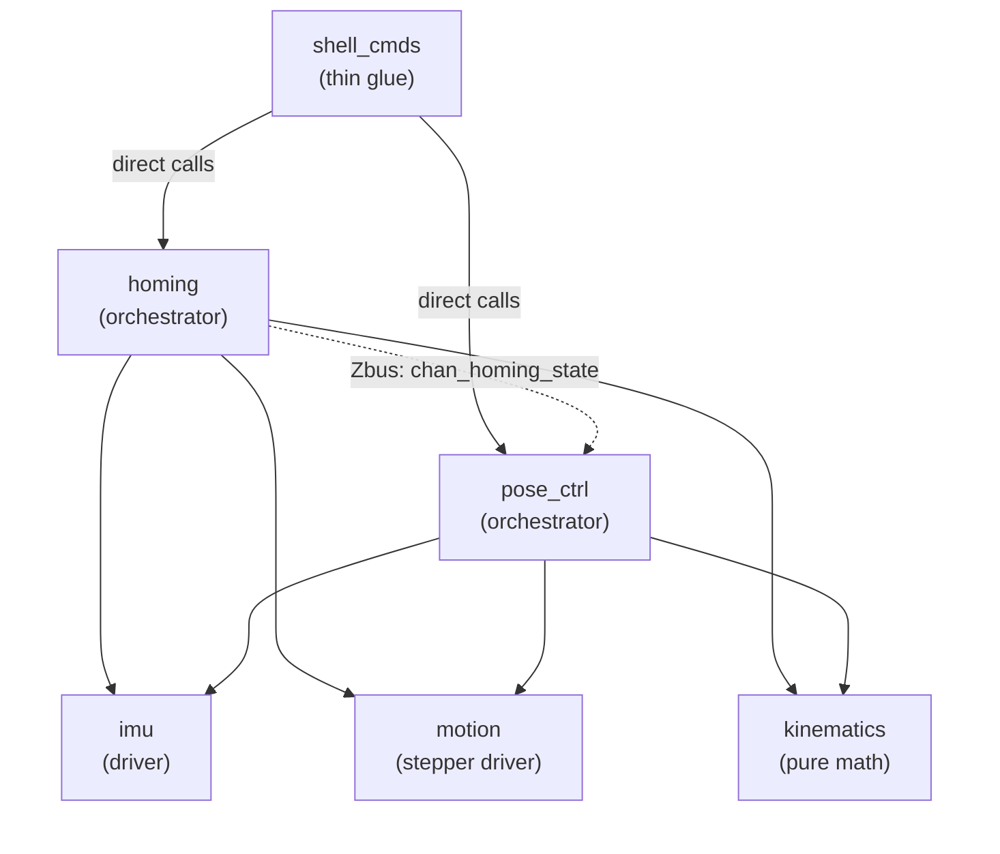
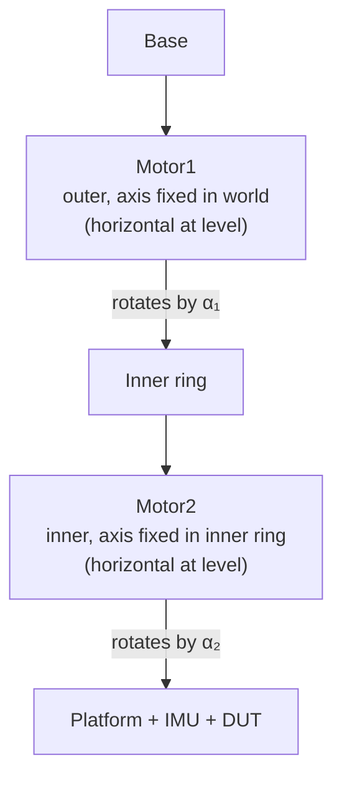
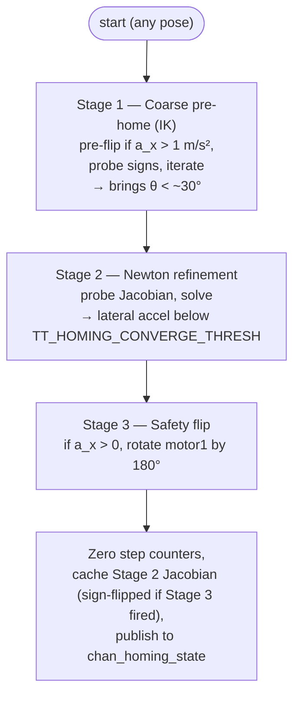

# 2DOF Tilt Platform — Application Firmware

Zephyr RTOS firmware for the **Seeed XIAO nRF52840 Sense** controlling a
2-DOF gimbal: two TMC2209 stepper drivers in step/dir mode, a SparkFun
LSM6DSO IMU on the moving inner ring, and a USB-CDC shell for control.

This document is the **design reference**. It explains the architecture,
the math behind the kinematics, and the algorithms used by homing and pose
control.

---

## Contents

1. [Quick start](#quick-start)
2. [Architecture](#architecture)
3. [Coordinate systems](#coordinate-systems)
4. [2-DOF gimbal kinematics](#2-dof-gimbal-kinematics)
5. [Tilt and azimuth](#tilt-and-azimuth)
6. [Motion control](#motion-control-stepper-rates-and-s-curve-ramp)
7. [Soft homing algorithm](#soft-homing-algorithm)
8. [Pose setting](#pose-setting)
9. [IMU calibration](#imu-calibration)
10. [Shell command reference](#shell-command-reference)
11. [Configuration](#configuration)
12. [Testing](#testing)

---

## Quick start

```bash
# From inside the dev container:
west build -b xiao_ble/nrf52840/sense app --pristine
west flash
```

Then connect via USB CDC ACM (115200 8N1) and run:

```
uart:~$ platform enable
uart:~$ platform home
uart:~$ platform set 30 45     # tilt 30° in azimuth direction 45°
```

---

## Architecture

The application is split into six components.



| Component | File path | Owns | Pure? |
|---|---|---|---|
| **kinematics** | `src/kinematics/` | Math: tilt/azimuth, forward & inverse gimbal kinematics, S-curve velocity profile | ✓ pure |
| **calib** | `src/calib/` | Math: 12-parameter affine accel-calibration least-squares fit + apply | ✓ pure |
| **motion** | `src/motion/` | Stepper devices, parallel-pair S-curve moves, completion semaphores, motor-name parsing | hardware |
| **imu** | `src/imu/` | LSM6DSO device, averaged accel reads (raw + calibrated), calibration session & persistence | hardware |
| **homing** | `src/homing/` | 3-stage soft-home, cached level Jacobian, "homed" state | orchestrator |
| **pose_ctrl** | `src/pose_ctrl/` | `set(θ, φ)`: IK fast path + Newton fallback | orchestrator |
| **shell_cmds** | `src/shell_cmds/` | `platform <cmd>` → component API dispatch | glue |

### Communication: zbus for state, direct calls for control loops

We use **zbus** (Zephyr's typed publish/subscribe bus) for **state and
events** that one component produces and another *might* care about. We do
**not** use it inside tight control loops where we just want to read an
IMU sample, compute a step, and move motors.

| Channel | Publisher | Subscriber(s) |
|---|---|---|
| `chan_homing_state` | `homing` (after home or invalidation) | `pose_ctrl` (read on demand) |


The shared message types and channel handles live in
[`include/app/zbus_channels.h`](include/app/zbus_channels.h).

---

## Coordinate systems

We use three different right-handed frames.

### World frame

Inertial reference. The only thing that matters for our purposes:

- **World up = +z_world** (away from gravity)
- gravity vector = (0, 0, −*g*) where *g* ≈ 9.81 m/s²

### Platform frame

Attached to the moving platter that holds the DUT. At the **level pose**
(both motors at the homing reference) the platform frame coincides with
the world frame:

- +x_p = right (world east)
- +y_p = forward (world north)
- +z_p = up (world up)

### IMU frame

The LSM6DSO chip is mounted on the platform with this physical orientation:

```
Looking down at the platform from above when level:

           +y_imu (right)
              ↑
              │
     ─────────┼──────── (chip sits flat on the platform)
              │
              ↓
            -y_imu (left)

  (-x_imu points OUT of the page = up toward sky;
   +z_imu points INTO the page  = "south" / toward viewer
                                  by the right-hand rule:
                                  +x × +y = +z, with +x = down)
```

So in platform coordinates:

| IMU axis | Platform axis |
|---|---|
| +x_imu | −z_p (down) |
| +y_imu | +x_p (right) |
| +z_imu | −y_p (back) |

Crucially: at the level pose, the proper acceleration the IMU reports
is **a ≈ (−g, 0, 0)** — gravity points along +x_imu, so the reaction
force the chip measures points along −x_imu.

> **Why the negative?** An accelerometer measures *proper* acceleration —
> the net non-gravitational force per unit mass acting on the chip. At
> rest the table pushes the chip *up* with force ‖m·g‖ to oppose gravity,
> so the chip reads +g in the "up" direction. Since "up" in IMU coords is
> −x_imu, you read a_x = −g.

---

## 2-DOF gimbal kinematics

The mechanical structure:



So the platform's orientation in the world frame is

$$
\mathbf{R}_\mathrm{WORLD \leftarrow PLATFORM}(\alpha_1, \alpha_2) = \mathbf{R}_x(\alpha_1) \cdot \mathbf{R}_y(\alpha_2)
$$

where (α₁, α₂) are *deviations from the level pose*, both in radians and
both zero at "homed level".

### Forward kinematics: gravity in IMU frame

We never need the full rotation matrix in firmware. What we *do* need is
how the gravity vector appears in the IMU frame as a function of (α₁, α₂).
Working it out (apply the inverse rotation to world-up and convert
platform→IMU coords):

$$
\boxed{\mathbf{g}_\mathrm{IMU}(\alpha_1, \alpha_2) = g \cdot
\begin{pmatrix}
\cos \alpha_1 \cos \alpha_2 \\
\sin \alpha_2 \cos \alpha_1 \\
\sin \alpha_1
\end{pmatrix}}
$$

Sanity checks:

| (α₁, α₂) | g_IMU / g | Meaning |
|---|---|---|
| (0, 0) | (1, 0, 0) | Level — gravity along +x_IMU = "down" |
| (0, 30°) | (0.87, 0.5, 0) | Tilted 30° around motor2 axis |
| (30°, 0) | (0.87, 0, 0.5) | Tilted 30° around motor1 axis |
| (90°, *) | (0, 0, 1) | Sideways — gravity along +z_IMU, α₂ irrelevant |

The proper acceleration is a = −g_IMU (the chip reads opposite to gravity).

### Inverse kinematics: motor angles from gravity

Given a measured g_IMU (from −a, with magnitude g), we want to recover (α₁, α₂):

$$
\boxed{
\begin{aligned}
\alpha_1 &= \arcsin(g_z / g) \\
\alpha_2 &= \arctan2(g_y,\; g_x)
\end{aligned}}
$$

This is implemented in `kin_alpha_from_accel()`.

### Gimbal lock at α₁ = ±90°

At α₁ = ±90°, g_x = g_y = 0 regardless of α₂ — the gravity vector points
straight along ±z_imu and **carries no information about α₂**. The IK
formula's `arctan2(0, 0)` returns 0 by convention, but the *true* α₂ is
unrecoverable from a single accel reading.

This matters for the coarse pre-home algorithm. The fix is to **iterate**:
the first IK move pushes α₁ away from ±90°, after which a second IK move
resolves α₂ correctly. See the [Soft homing](#soft-homing-algorithm)
section.

### Forward IK: target motor angles for a desired pose

If we want to reach a pose described by (tilt θ, azimuth φ) — see next
section — the target gravity direction in the IMU frame is
`(cos θ, sin θ cos φ, −sin θ sin φ) · g`. Setting that equal to the forward
formula and solving:

$$
\boxed{
\begin{aligned}
\alpha_1^\mathrm{TARGET} &= \arcsin(-\sin\theta \sin\varphi) \\
\alpha_2^\mathrm{TARGET} &= \arctan2(\sin\theta \cos\varphi,\; \cos\theta)
\end{aligned}}
$$

Implemented in `kin_alpha_from_target()`.

---

## Tilt and azimuth

The user-facing pose space is **spherical**, not roll/pitch. This matches
what the platform actually does: tilt a DUT against gravity in some
direction.

- **Tilt θ** ∈ [0°, 180°]: angle between platform-up (= −x_imu) and the
  measured gravity-up direction. θ = 0 means level; θ = 90° means
  sideways; θ = 180° means upside-down.

- **Azimuth φ** ∈ (−180°, 180°]: direction the platform has tilted
  ("downhill" direction in the level plane), measured **CCW from +y_imu
  when viewed from above**.

| φ | Direction the platform tilts toward |
|---|---|
| 0° | +y_imu (right, = +x of the DUT) |
| +90° | −z_imu |
| ±180° | −y_imu (left) |
| −90° | +z_imu |

### Conversion: accel → (tilt, azimuth)

From a measured a_IMU:

$$
\boxed{
\begin{aligned}
\theta &= \arctan2\left(\sqrt{a_y^2 + a_z^2},\; -a_x\right) \\
\varphi &= \arctan2(a_z,\; -a_y)
\end{aligned}}
$$

The tilt formula is the **two-axis** form (atan2 of lateral magnitude vs
vertical component) rather than `arccos(-a_x / |a|)`. Both are
algebraically equivalent over [0, π], but `arccos` has a vertical tangent
at its endpoints — small accel noise blows up into large tilt error near
level (θ → 0) and inverted (θ → π). The atan2 form is uniformly accurate
across the full range and avoids the |a| division.

Implemented in `kin_compute_tilt()`. Worked example: at θ = 30°, φ = 45°,
the target gravity direction is (cos 30°, sin 30°·cos 45°, −sin 30°·sin 45°)
= (0.866, 0.354, −0.354), so a = (−8.49, −3.47, +3.47) m/s².

### Conversion: (tilt, azimuth) → target accel

The forward map, used by the pose controller as the goal of its Newton
iteration:

$$
\boxed{
\mathbf{a}_\mathrm{TARGET} = -g \cdot \begin{pmatrix}
\cos \theta \\
\sin \theta \cos \varphi \\
-\sin \theta \sin \varphi
\end{pmatrix}}
$$

Implemented in `kin_target_accel()`.

---

## Motion control: stepper rates and S-curve ramp

### Stepper basics

Both axes use a TMC2209 driver in step/dir mode. The MS1/MS2 pins are
**hardware-strapped** on the PCB to **1/64 microstepping**, so:

- 200 full steps/rev × 64 = **12800 microsteps/rev**
- 360° / 12800 = **0.028125° per microstep**
- 12800 / (2π) ≈ **2037 microsteps per radian**

The motion driver knows nothing about microstepping — it just toggles the
STEP pin at intervals we set. Direction is the DIR pin.

### Why we need a ramp

A NEMA17 stepper can't be commanded to its top speed instantly: the rotor
has inertia, and trying to step faster than the rotor's response time
causes **step skipping** (the magnetic field jumps to the next pole, the
rotor doesn't follow, and you silently lose position).

The standard fix is a **velocity profile**: ramp the step rate up
gradually, run at constant speed during the cruise, and ramp down before
stopping.

### S-curve velocity profile

We use a **smoothstep** profile:

$$
v(s) = v_\mathrm{MIN} + (v_\mathrm{MAX} - v_\mathrm{MIN}) \cdot s^2 (3 - 2s)
$$

where *s* ∈ [0, 1] is the fractional progress through the acceleration
phase. The smoothstep `s²(3−2s)` has zero derivative at both ends, so the
acceleration ramps in and out smoothly (continuous-jerk envelope) — much
gentler on the rotor than a trapezoidal profile that hits constant
acceleration instantly.

```
    velocity
      │
v_max ─┤        ╭──────────────────╮
      │       ╱│                  │╲
      │      ╱ │                  │ ╲
      │     ╱  │                  │  ╲
      │    ╱   │                  │   ╲
v_min ─┤───╯   │                  │    ╰────►  step
      │  accel│      cruise      │decel
      │  (n_ramp)                 │(n_ramp)
      └──────────────────────────────────►
       0      n_ramp    total-n_ramp    total
```

If the move is shorter than `2·n_ramp` total steps the cruise phase
disappears and we get a **triangular** profile that just touches v_max at
the apex.

The math is implemented in
[`kin_scurve_velocity()`](src/kinematics/kinematics.c) — pure function,
unit-tested in [`tests/kinematics`](tests/kinematics).

### How we drive this profile in the gpio-step-dir driver

Zephyr's `gpio-step-dir-stepper-ctrl` driver only supports a constant step
interval per move. So we do the ramp at the application level by **slicing
each move into N equal-fraction segments** (default N = 32) and calling
`stepper_ctrl_set_microstep_interval()` between segments:

```
for i = 0 .. N-1:
    seg_steps = next_chunk(total, N, i)
    v        = scurve_velocity(progress)
    set_microstep_interval(motor, 1e9 / v)
    stepper_ctrl_move_by(motor, seg_steps)
    wait for STEPS_COMPLETED event
```

The "wait for event" gap between segments is sub-millisecond on this MCU
— much shorter than the rotor's mechanical decel time, so the motor
doesn't actually stop between segments; the velocity just changes.

### Parallel motors

Both motors usually need to move together (Newton steps and `set` moves
displace both axes). We issue the segment to motor1, the segment to
motor2, then wait for both `STEPS_COMPLETED` events:

```c
k_sem_reset(&motor1_done);
k_sem_reset(&motor2_done);
stepper_ctrl_move_by(motor1, seg1);
stepper_ctrl_move_by(motor2, seg2);
k_sem_take(&motor1_done, timeout);
k_sem_take(&motor2_done, timeout);
```

Each motor runs its own per-motor S-curve based on its own move size, so a
small move on one axis doesn't stall the larger move on the other. The
implementation is `motion_pair_by()` and `motion_pair_to()` (relative and
absolute). See [`motion.c`](src/motion/motion.c).

---

## Soft homing algorithm

Stepper motors have no absolute position sense. To establish a reference
(the "level" pose where both step counters = 0), we need to find level
**from wherever the platform happens to be** when `platform home` is run.
The IMU is the only absolute sensor we have.

Because the DUT hangs off motor2 in an unbalanced way, when the drivers
are disabled, gravity pulls motor1 to its mechanical equilibrium — usually
≈ 90° offset from the level pose. So homing has to handle starting from
nearly anywhere in the gimbal's range, including near the saddle pose
(α₁ ≈ ±90°, α₂ ≈ ±90°) where probes may be degenerate.

The algorithm is **3 stages**:



### Stage 1 — coarse pre-home (IK)

We use inverse kinematics directly. The geometric step-to-radian factor
is fixed by hardware (`c_mag = 2π/12800` rad per microstep at 1/64), so
all we need from a probe is the **sign** of each motor — does positive
DIR rotate the platform in +α₁ / +α₂ or in −α₁ / −α₂?

```
0. Read accel. If a_x > 1 m/s², pre-flip motor1 by 180° (= 6400 μsteps).
1. Probe motor1 by ±N microsteps; record Δa_z. sign1 = −sign(Δa_z).
2. Probe motor2 by ±N microsteps; record Δa_y. sign2 = −sign(Δa_y).
3. If either response < min_response (saddle pose), kick both motors
   and re-probe. After 2 retries, give up.
4. Iterate up to 3 times:
   a. Read accel.
   b. If tilt < skip_threshold, done.
   c. Compute (α₁, α₂) from IK.
   d. Move motor1 by −α₁/c1, motor2 by −α₂/c2 in parallel.
```

The **pre-flip** at step 0 handles the upside-down basin. The IK formula
`α₁ = arcsin(g_z/g)` has range [−π/2, π/2], so it can't see the half-
revolution near α₁ = ±π — there sin α₁ ≈ 0 and the IK move shrinks to
zero, so iterative IK gets stuck. A 180° motor1 rotation always maps
upside-down (a_x > 0) to right-side-up regardless of α₂. The 1 m/s²
threshold corresponds to roughly α₁ more than 96° off level — below
that, IK on its own pulls the platform back.

We iterate because of **gimbal lock at α₁ = ±90°**: from a single accel
reading there, α₂ is undetermined, so the first move only fixes α₁; the
second move resolves α₂. Two iterations cover almost any starting pose,
three handles edge cases.

### Stage 2 — Newton refinement

Now within ~30° of level, we use a **probe Jacobian + Newton iteration**
to drive the lateral accel components to zero with high precision:

```
Probe motor1 by ±N steps → measure (Δa_y, Δa_z) per step → fill J's first column
Probe motor2 by ±N steps → ...                            → second column

J = | jcol[0][0]   jcol[1][0] |   ← row for a_y
    | jcol[0][1]   jcol[1][1] |   ← row for a_z

Iterate up to max_iter:
    e = (a_y, a_z)
    if |e| < converge_thresh: break
    Δ = -J⁻¹ · e  (Cramer's rule)
    move both motors by Δ
```

This is a **modified Newton** method — we re-use the same Jacobian
between iterations. It converges quadratically near the solution and
linearly farther out. Three iterations is typically plenty.

### Stage 3 — safety flip

The Newton iteration only zeros the lateral accel components. Both
*level* (a_x = −g) and *upside-down* (a_x = +g) satisfy that. With the
Stage 1 pre-flip in place this stage rarely fires, but it stays as a
safety net for cases where Newton converges into the wrong basin: if
a_x > 0 we rotate motor1 by 6400 microsteps (= 180°). At the converged
pose motor1's rotation axis lies in the horizontal plane, so a 180°
rotation around it inverts a_x while preserving a_y, a_z ≈ 0.

### After all three stages

- Step counters zeroed (`motion_set_reference(motor, 0)`).
- The **Stage 2 Jacobian** is reused as the cached level Jacobian, with
  every entry negated if Stage 3 fired. (Substituting α₁ → α₁ − π in the
  kinematic model negates each accel component, so each Jacobian entry
  flips sign too. The determinant is invariant.) This skips a redundant
  re-probe — saves ~22.5° of total motor motion per home — at the cost
  of probing the Jacobian at the post-coarse pose rather than exactly at
  level. The cos α attenuation is at most ~13% (at 30° off) and typically
  under 1%; the pose-ctrl fast path's fall-through to Newton absorbs any
  residual error.

The full implementation is in [`homing.c`](src/homing/homing.c).

---

## Pose setting

`platform set <θ> <φ>` drives the platform to the commanded pose using IMU
feedback. There are two paths:

### Fast path (when homed): closed-form IK

If `chan_homing_state.homed` is true, we already have the cached
Jacobian, which encodes the **signed** step-to-rad conversion factors:

$$
c_1 = -\mathrm{JAC}[0][1] / g, \qquad c_2 = -\mathrm{JAC}[1][0] / g
$$

The cached Jacobian comes from Stage 2 of homing (probed within
`skip_threshold` of level), so the off-diagonal terms carry a small
`cos α` attenuation — typically <1%, worst case ~13% if Stage 1 left us
30° off. Any resulting overshoot/undershoot in the fast-path move shows
up as a lateral residual; if it exceeds `TT_HOMING_CONVERGE_THRESH_MILLI_MS2`
the code falls through to Newton.

We then compute the target motor angles via forward IK
(`kin_alpha_from_target`) and convert directly to absolute step counts:

```
α₁_target = arcsin(-sin θ sin φ)
α₂_target = arctan2(sin θ cos φ, cos θ)
step1     = α₁_target / c1     (absolute step counter target)
step2     = α₂_target / c2
motion_pair_to(step1, step2)   (single parallel S-curve move)
```

Then we read the IMU and compute the lateral residual `|a − a_target|`. If
it's under `TT_HOMING_CONVERGE_THRESH_MILLI_MS2` (default 0.4 m/s², ≈ 2.3° tilt),
we're done — **no probe, no Newton**. For target tilts up to 45° the IK
should land within step resolution (≈ 0.028°) of the goal, so this is the
typical path; tightening the threshold below ~0.1 m/s² triggers Newton on
nearly every set, which is unnecessary given step resolution and IMU
noise.

### Newton path (fallback)

If the fast path missed (residual too large) or the platform isn't homed,
we fall through to the same probe-Jacobian + Newton iteration as stage 2
of homing, but with the goal being the *target* lateral accel rather than
zero:

```
e = (a_y - a_y_target, a_z - a_z_target)
Δ = -J⁻¹ · e
```

Implementation in [`pose_ctrl.c`](src/pose_ctrl/pose_ctrl.c).

---

## IMU calibration

An uncalibrated LSM6DSO reads a static accel with a few tenths of a m/s² of
error — dominated by the **zero-g offset** (datasheet typ ±20 mg, up to
±40 mg ≈ 0.39 m/s²), plus sensitivity (scale) error, axis non-orthogonality,
and the **mechanical mounting misalignment** of the chip relative to the
platform frame. On this rig the residual lateral accel after a `set` is
often ≈ 0.4 m/s², i.e. about a 2.3° tilt error.

### Model

We fit a single **12-parameter affine map** applied in the read path:

$$
\mathbf{a}_\mathrm{corrected} = \mathbf{A} \cdot
\begin{pmatrix} a_\mathrm{raw,x} \\ a_\mathrm{raw,y} \\ a_\mathrm{raw,z} \\ 1 \end{pmatrix},
\qquad \mathbf{A} \in \mathbb{R}^{3\times4}
$$

The 3×3 block absorbs scale + cross-axis/misalignment; the 4th column is the
bias. Crucially this folds the **IMU-to-platform mounting rotation** into the
same map, so corrected readings obey the ideal IMU-frame gravity model the
kinematics already assume — **homing, pose_ctrl and kinematics need no
changes**, the correction is entirely inside `imu_read_accel_avg()`.

> A magnitude-only ("ellipsoid") fit — the kind that only needs `|a| = g` and
> no known orientation — **cannot** recover the mounting rotation, because a
> rotation preserves magnitude. That is exactly why we establish each pose's
> true gravity direction with an external laser reference.

### The 6-position laser procedure

Mount a laser pointer to the DUT frame and use a self-leveling cross-line
laser as the absolute reference. Its two beams (one vertical, one horizontal)
pin the platform orientation in exactly the 2 DOF the gimbal controls. For
each of the six poses, drive the platform (with `platform move`) until the
DUT-frame pointer lands on the cross reference, then capture:

| Pose | IMU axis pointing up | Target reading (proper accel) |
|---|---|---|
| `x+` | +x_imu | (+g, 0, 0) |
| `x-` | −x_imu (= the level pose) | (−g, 0, 0) |
| `y+` | +y_imu | (0, +g, 0) |
| `y-` | −y_imu | (0, −g, 0) |
| `z+` | +z_imu | (0, 0, +g) |
| `z-` | −z_imu | (0, 0, −g) |

The laser's ±1.5 mm / 5 m spec is an angular floor of atan(1.5/5000) ≈
**0.017°** — far tighter than the IMU, so it is effectively the truth.

### Solving

Each captured pose gives one observation (raw vector ↔ known target). The fit
is linear least squares; because the three output rows share the same normal
matrix N = Σ xₚxₚᵀ, the whole solve is **one 4×4 elimination with three
right-hand sides** — trivial on the M4F. With six poses that's 18 equations
for 12 unknowns (overdetermined); the reported RMS residual is the headline
"how good is this calibration" number. The math is the pure, host-tested
[`calib`](src/calib/calib.c) module (ST AN3192 / DM00119044 method).

### Persistence

A solved map is stored as a versioned blob via the Zephyr **settings**
subsystem (NVS backend on the board's `storage_partition`) and reloaded at
boot. `valid = false` means "no calibration" → raw pass-through, which
reproduces the pre-calibration behaviour exactly.

### Expected improvement

| Metric | Uncalibrated | After calibration |
|---|---|---|
| Static accel error | ~0.4 m/s² | ~0.02–0.05 m/s² |
| Tilt error (any θ) | ~2.3° | ~0.1–0.3° |
| Azimuth error @ θ=30° | ~4.7° | ~0.3–0.6° |

Roughly a **10× improvement**, with temperature drift between calibration and
use as the residual floor (the die temperature is logged at solve time for
exactly this reason). Once calibrated you can safely tighten
`TT_HOMING_CONVERGE_THRESH_MILLI_MS2` so the IK fast path converges to step
resolution rather than to IMU bias.

### Worked session

```
uart:~$ platform calib start
Calibration session started. Level each IMU axis with the laser, then ...
uart:~$ platform calib capture x-      # level pose first
Captured x-: raw ax=-9.412 ay=+0.231 az=-0.187 m/s²  (1/6 poses)
uart:~$ platform calib capture x+
...
uart:~$ platform calib capture z-
Captured z-: raw ax=+0.043 ay=-0.092 az=-9.560 m/s²  (6/6 poses)
uart:~$ platform calib solve
Calibration solved, residual = 0.018 m/s² (RMS).
A = [3×4 affine, a_corrected = A·(a_raw,1)]:
  [+1.00731 +0.00194 -0.00981 | +0.34812]
  [-0.01492 +0.97214 +0.02488 | -0.19905]
  [+0.00803 -0.01970 +1.00942 | +0.15003]
```

---

## Shell command reference

Connect via USB CDC ACM (115200 8N1).

| Command | Description |
|---|---|
| `platform enable` | Enable both TMC2209 drivers (powers the motor coils) |
| `platform disable` | Disable both drivers; invalidates the cached homing state |
| `platform move <m> <steps>` | Jog motor (`motor1`/`motor2`) by ±N microsteps |
| `platform run <m> <±>` | Run motor continuously in given direction |
| `platform stop <m>` | Stop a running motor |
| `platform pos <m>` | Print step counter |
| `platform home` | Run the 3-stage soft homing |
| `platform set <θ> <φ>` | Drive platform to (tilt, azimuth) in degrees |
| `platform imu read` | Read accel and print (a_xyz, tilt, azimuth) |
| `platform calib start` | Begin a fresh 6-pose calibration session |
| `platform calib capture <x±\|y±\|z±>` | Capture the current laser-leveled pose |
| `platform calib solve` | Solve the affine fit, install and persist it |
| `platform calib show` | Print the active calibration map |
| `platform calib clear` | Drop calibration (raw pass-through), erase stored |
| `platform dfu` | Reboot into the UF2 bootloader |

### Typical session

```
uart:~$ platform enable
Stepper drivers enabled (run 'platform home' to soft-home)
uart:~$ platform home
Coarse pre-home: starting θ=92.13°
  probe: Δa_z(m1)=-0.42 Δa_y(m2)=-0.39 m/s²
  signs: motor1=+1 motor2=+1 (c1=+0.000491 c2=+0.000491 rad/μstep)
  iter 0: θ=92.13° α=(11.35°, -1.42°) → move (-403, 50)
  iter 1: θ=4.71° (converged)
Probing Jacobian (200 steps per axis)...
Jacobian: [[+0.0001, -0.0048], [-0.0048, +0.0001]] det=-0.0000232
iter 0: θ=4.71° φ=37.20° |lat|=0.81 m/s²
iter 1: θ=0.34° φ=12.10° |lat|=0.058 m/s²
Final: θ=0.34° φ=12.10° |lat|=0.058 m/s²
Homing complete; counters zeroed and Stage 2 Jacobian cached (det=-2.32e-05)
uart:~$ platform set 30 45
Target: θ=30.00° φ=45.00°  (a_y=-3.467 a_z=+3.467 m/s²)
Fast: α=(-21.47°, +23.41°) → move_to motor1=-764 motor2=832
Fast: θ=29.95° φ=45.21° |err|=0.07 m/s²
Final: θ=29.95° (target 30.00°, Δ=-0.05°) φ=45.21° (target 45.00°, Δ=+0.21°)
```

If the platform starts upside-down, the Stage 1 pre-flip kicks in:

```
uart:~$ platform home
Inverted at start (a_x=+9.781) — pre-flipping motor1 by 180°
Coarse pre-home: starting θ=2.43°
  probe: ...
```

---

## Configuration

Tunable Kconfig values (in [`Kconfig`](Kconfig)). All project-introduced
symbols use the `TT_<COMPONENT>_` prefix so they're greppable and
self-documenting about ownership.

| Symbol | Default | Meaning |
|---|---|---|
| `TT_MOTION_STEP_INTERVAL_NS` | 1000000 | Initial step interval; mostly overridden by S-curve |
| `TT_MOTION_MAX_STEP_RATE` | 8000 | S-curve cruise step rate (μsteps/sec) |
| `TT_MOTION_MIN_STEP_RATE` | 500 | S-curve start/end step rate (μsteps/sec) |
| `TT_MOTION_RAMP_STEPS` | 400 | Distance over which velocity ramps min ↔ max (μsteps) |
| `TT_MOTION_RAMP_SEGMENTS` | 32 | Number of constant-velocity segments per move |
| `TT_HOMING_PROBE_STEPS` | 200 | Jacobian probe size (used by homing **and** pose-ctrl Newton) |
| `TT_HOMING_MAX_ITERATIONS` | 3 | Max Newton iterations (used by homing **and** pose-ctrl Newton) |
| `TT_HOMING_CONVERGE_THRESH_MILLI_MS2` | 400 | Lateral-residual convergence threshold (milli-m/s²) |

If motors skip steps under load: lower `TT_MOTION_MAX_STEP_RATE` or raise
`TT_MOTION_RAMP_STEPS`. If homing is too slow: raise
`TT_MOTION_MAX_STEP_RATE` and lower `TT_MOTION_RAMP_SEGMENTS`. If `set`
falls through to Newton too often: raise
`TT_HOMING_CONVERGE_THRESH_MILLI_MS2` (the unit is milli-m/s² because
Kconfig has no float type — 400 = 0.4 m/s²).

---

## Testing

Pure-math components have unit tests on `native_sim`. From the workspace
root:

```bash
west twister -T app/tests --platform native_sim/native/64
```

Currently covered:

| Suite | Coverage |
|---|---|
| `app.kinematics` | Tilt/azimuth conversions, IK round-trips at multiple poses, S-curve velocity profile (start/cruise/decel/triangular/monotonic) |
| `app.calib` | Affine fit recovery (identity + bias/scale/misalignment), residual vs. injected noise, error paths (too few / degenerate poses), in-place and pass-through apply |

To add tests for hardware-touching components (motion, imu, homing), use
the `zephyr,fake-stepper-controller` upstream driver and a fake
accelerometer that synthesizes gravity from a virtual gimbal pose model.
That scaffolding is intentionally not yet in the tree.
